  
  
  

    System Integration Specialist &nbsp;•&nbsp; Germany 🇩🇪
  

  

 

### ⚡ Tech Stack

<table align="center">
  <tr>
    <td align="center" width="90"><b>Core</b></td>
    <td></td>
  </tr>
  <tr>
    <td align="center" width="90"><b>Backend</b></td>
    <td></td>
  </tr>
  <tr>
    <td align="center" width="90"><b>Frontend</b></td>
    <td></td>
  </tr>
  <tr>
    <td align="center" width="90"><b>DevOps</b></td>
    <td></td>
  </tr>
  <tr>
    <td align="center" width="90"><b>Tools</b></td>
    <td></td>
  </tr>
</table>

 

### 🚀 Selected Works

<table border="0" width="100%">
  <tr>
    <td width="50%" align="left" valign="top">
      <b>⚔️ Stormbound Isles</b> 
      Fabric Plugin (1.20.1) — Competitive five-team PvP with dynamic island perks and elemental world events.
        
      
      
    </td>
    <td width="50%" align="left" valign="top">
      <b>💀 Blightfall: Melaferus</b> 
      Dark medieval roguelite deckbuilder built in Godot. Systemic world corruption and lethal run-based progression.
        
      
      
    </td>
  </tr>
</table>

<table border="0" width="100%">
  <tr>
    <td width="100%" align="center">
       
      
      

         
        <b>🎮 Quantara Studios</b> 
        Independent Game Development Studio focused on immersive high-fidelity experiences and systemic gameplay across multiple platforms.
          
        
        
        
      

    </td>
  </tr>
</table>

 

### 📈 Analytics

  
  

  

