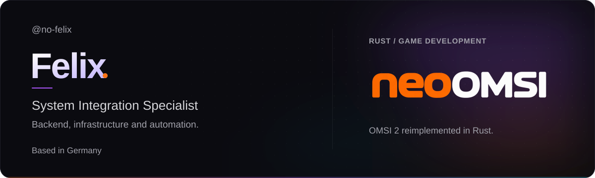
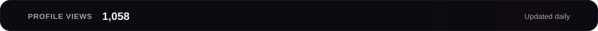
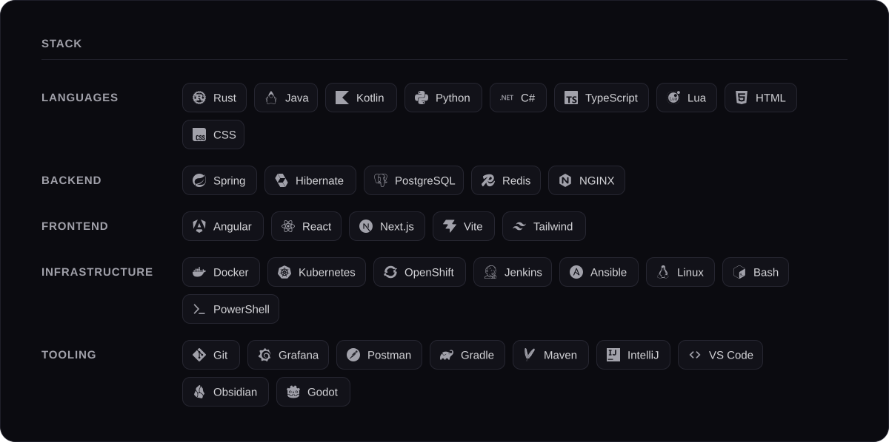
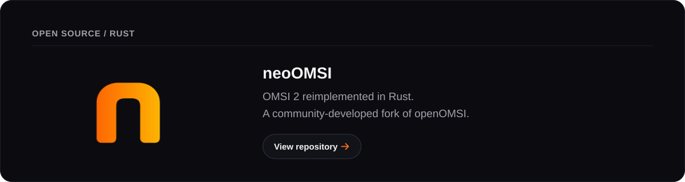
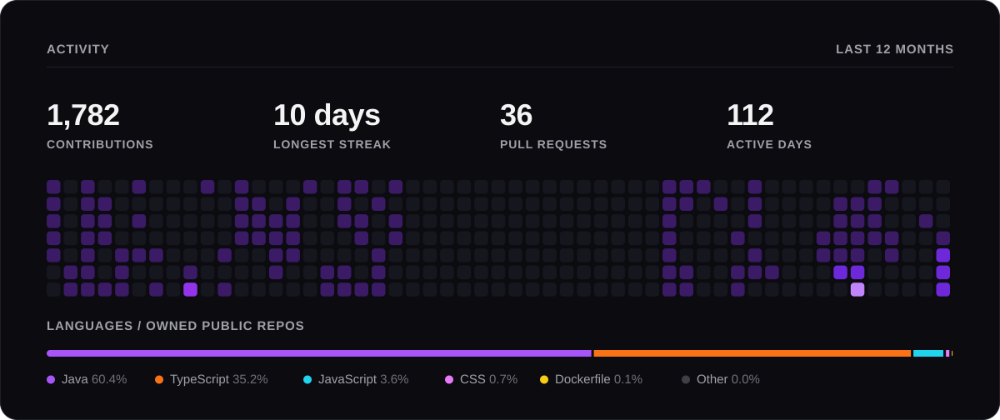
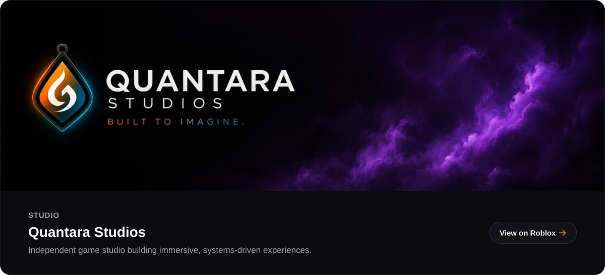

 
 

 
 

 
 

 
 

<!-- Profile cards are refreshed daily by .github/workflows/activity.yml.
     To refresh manually, run the workflow or use Node 20+:
     GITHUB_TOKEN=<token> node scripts/activity.mjs no-felix
     node scripts/profile-views.mjs
     Language usage measures code size in owned public repositories, not proficiency. -->

<!-- The tiny Komarev image keeps recording image requests while the visible footer
     shows a daily snapshot. GitHub caches images; these are not unique visitor counts.
     Scheduled counter refresh requests also contribute to the total. -->

<!-- The unaltered neoOMSI wordmark and logo identify the project linked in its card,
     as permitted by https://github.com/neoOMSI/neoOMSI/blob/main/TRADEMARKS.md. -->
